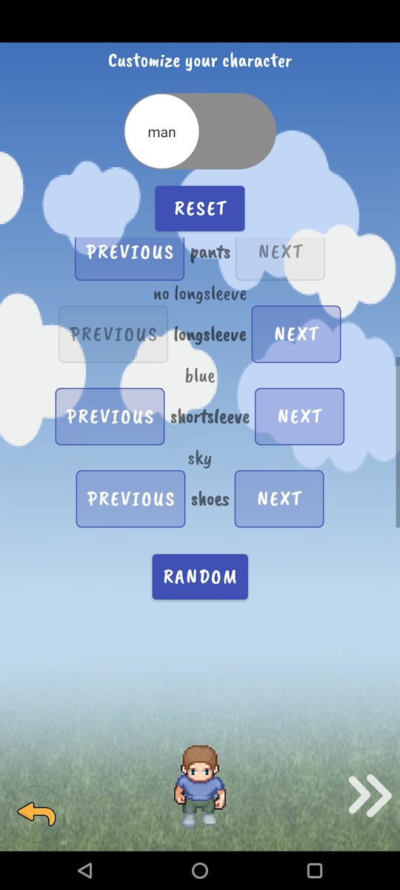

# Game-Character-Creator

Android library module that is responsible for creating game main character's look. User can choose his sex, skin, hair (haircut type and color), pants, longsleeve/shortsleeve, shoes.

It is based on <ins>MVP</ins> architectural pattern and uses <ins>Decorator</ins> structural pattern.


### How to prepare
1) app → new → module → import → :charactercreator

2) build.gradle → dependencies → implementation(project(':charactercreator'))

### Important
onNextPressed is required to be instantiated before start this Activity in order to have access to UserLookDTO, this Activity and bitmapFinal

### Usage
Starting this Activity could be like this - having defined IOnNextPressed:
```
public interface IOnNextPressed {
    void onPressed(UserLookDTO userLookDto, Activity activity, Bitmap bitmapFinal);
}
```
we can do the following:
```
@Override
protected void onCreate(Bundle savedInstanceState) {

    (...)    
    ActivityCharacterCreator.setOnNextPressed(Util::showInfoAlertDialog);
    Intent characterCreatorIntent = new Intent(ActivityMain.this, ActivityCharacterCreator.class);
    startActivity(characterCreatorIntent);
}
```
```
public static void showInfoAlertDialog(UserLookDTO userLookDto, Activity activity, Bitmap bitmapFinal) {
    new AlertDialog.Builder(activity)
        .setTitle(R.string.information)
        .setMessage(R.string.are_you_sure_you_like_the_look)
        .setPositiveButton(android.R.string.ok, (dialog, which) -> {
            ByteArrayOutputStream byteArrayOutputStream = new ByteArrayOutputStream();
            bitmapFinal.compress(Bitmap.CompressFormat.PNG, 100, byteArrayOutputStream);
            byte[] byteArray = byteArrayOutputStream.toByteArray();
            String spriteEncoded = Base64.encodeToString(byteArray, Base64.DEFAULT);
            SharedPrefs.write("customized_sprite_" + SharedPrefs.read("login", ""), spriteEncoded);

            FirebaseDbDao firebaseDbDao = FirebaseDbDao.getInstance();

            firebaseDbDao.setUserSprite(SharedPrefs.read("user_id", ""), spriteEncoded, userLookDto);
            Intent intent = new Intent(activity, ActivityCredentialsLogin.class);
            intent.addFlags(Intent.FLAG_ACTIVITY_NEW_TASK);
            intent.putExtra("sprite_created", activity.getString(R.string.character_successfully_created_now_you));
            activity.startActivity(intent);
            activity.finish();
        })
        .setNegativeButton(android.R.string.cancel, (dialog, which) -> exitToMain(activity))
        .setIcon(android.R.drawable.ic_dialog_info)
        .setCancelable(false)
        .show();
}
```

### Screenshot




PS: Character image resources taken from https://sanderfrenken.github.io/Universal-LPC-Spritesheet-Character-Generator/.


